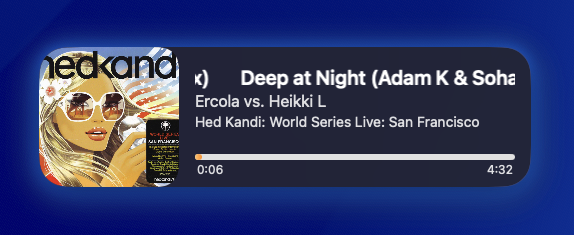
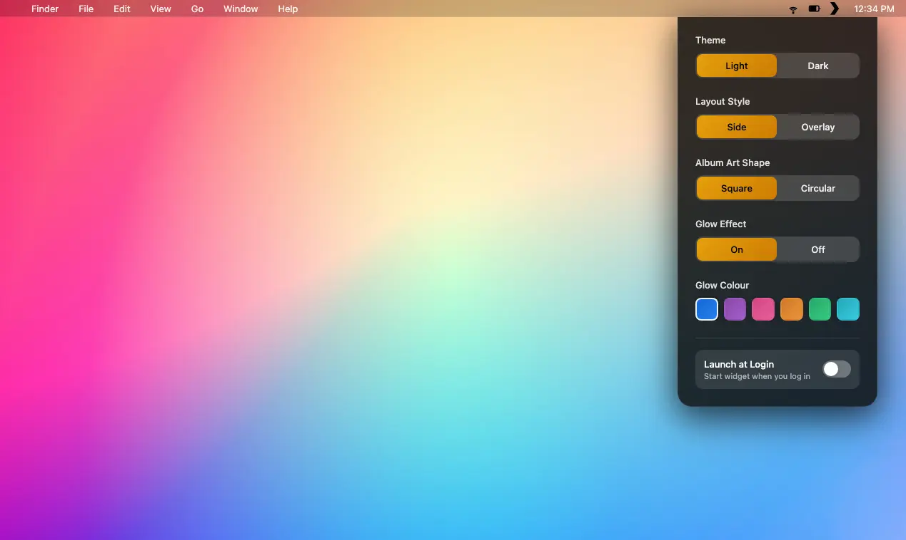

# Plex Desktop Widget

<div align="center">

[](https://www.apple.com/macos)
[](https://swift.org)
[](LICENSE)

**A Beautiful Floating Desktop Music Player for Your Plex Library**

*Control your music without leaving your desk. Gorgeous. Customizable. Always there.*



</div>

---

## What Is Plex Desktop Widget?

Tired of hunting through windows to control your Plex music? Meet your new favorite desktop companion.

Plex Desktop Widget puts a sleek, customizable floating player right on your macOS desktop. See what's playing, skip to the next track, and discover your music—all without switching away from what you're working on.

It's designed to be beautiful by default and endlessly customizable.

---

## Features

### Now Playing Widget
- Elegant floating player that stays on top of your other windows
- Real-time album art display with your current track info
- Glowing effects that complement your music mood
- Seamless integration with your Plex Media Server

### Customization Options
- **Multiple Themes**: Light and dark modes to match your setup
- **Layout Styles**: Choose between side-by-side player or overlay style
- **Album Art Shapes**: Square or circular album artwork frames
- **Glow Effects**: Toggle on/off and pick your favorite glow color from a color palette
- **Auto-Launch**: Start the widget automatically when you log in

### Playback Controls
- Play and pause your current track
- Skip forward or back through your playlist
- Instant access to track information (title, artist, album)

### Privacy & Security
- Your Plex login credentials are stored securely in macOS Keychain
- No cloud syncing—everything stays local on your device
- Direct connection to your Plex Media Server

---

## Screenshots

<div align="center">

**Widget Showcase**
Multiple styles and customization options


**Customization Settings**
Tailor the widget to your style



</div>

---

## Getting Started

### Requirements
- macOS 13.0 or later
- Plex Media Server with music library
- Active Plex account with authentication token

### Installation

#### App Store (Coming Soon)
The easiest way to install Plex Desktop Widget will be through the App Store. We're working on making it available soon!

#### Build from Source
If you'd like to try the latest development version:

1. Clone this repository:
   ```bash
   git clone https://github.com/impactcrew/plex-desktop-widget.git
   cd plex-desktop-widget
   ```

2. Open `PlexWidget.xcodeproj` in Xcode

3. Select your Mac as the target and hit Run

---

## How to Get Your Plex Token

You'll need your Plex authentication token to connect the widget to your server.

### Method 1: Easy Web Method (Recommended)
1. Go to your Plex Dashboard: [app.plex.tv/web](https://app.plex.tv/web)
2. Log in with your Plex account
3. Click your profile picture → Settings → Account
4. Under "Access tokens," you'll see your token
5. Copy and paste it into the widget settings

### Method 2: Command Line
If you prefer the terminal:
```bash
curl -u your-email:your-password https://plex.tv/users/account/token/xml | grep -oP 'token="\K[^"]*'
```

---

## Planned Features

We're constantly improving Plex Desktop Widget. Here's what's coming:

- **Continuous Mix**: Smooth playback without blank screens between tracks
- **Compact Mini View**: A smaller widget option for screens with limited space

Got a feature request? Let us know!

---

## System Requirements

| Requirement | Details |
|---|---|
| **OS** | macOS 13.0 or later |
| **Memory** | Minimal (runs in the background) |
| **Connection** | Local network access to Plex Media Server |
| **Plex Account** | Free tier supported (authentication required) |

---

## Privacy & Security

- Your Plex credentials are stored securely in macOS Keychain
- The widget communicates directly with your Plex Media Server—no intermediary servers
- No analytics, no tracking, no advertisements
- Your music library data never leaves your local network

---

## Troubleshooting

### Widget won't connect to my Plex server
- Make sure your Plex Media Server is running and accessible
- Verify your Plex token is correct (copy it again if needed)
- Check that your Mac can reach your server on the local network

### Album art not showing
- Ensure the music in your Plex library has proper metadata
- Try refreshing the widget or playing a different track

### Need more help?
Open an issue on GitHub or check the documentation.

---

## License

Plex Desktop Widget is released under the MIT License. See [LICENSE](LICENSE) for details.

---

## Credits

Built with love for Plex users who deserve beautiful software.

Powered by Swift and SwiftUI on macOS.

---

<div align="center">

**Made with care for music lovers**

[Report an Issue](https://github.com/impactcrew/plex-desktop-widget/issues) • [Suggest a Feature](https://github.com/impactcrew/plex-desktop-widget/discussions)

</div>
